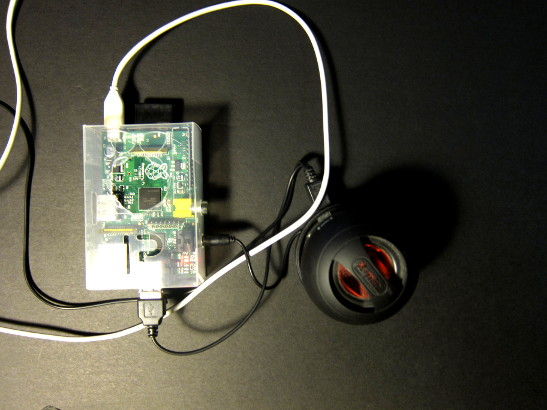

pipumpkin
=========
This is a python program which accepts text-to-speech requests sent to an e-mail account and plays them out using espeak/pyttsx.
It is planned to be placed inside a pumpkin for office or home use. I placed it inside a bogeyman and put up instructions nearby:

Power supply was through the legs, but if you're serious about keeping it a surprise, a battery pack is a must!

Make it yourself
================
You'll need:
* A Raspberry Pi
* A speaker system. Battery or USB-powered speakers can be embedded more easily!
* A gmail account with one folder to be used as a "speech queue"

Set-up
======
* Check-out this repository on the pi filesystem
* Create a folder (label) in your gmail account.
* Install the requirements; see helper scripts in 'setup'
* Create a json file with your mail server account details: copy pipumpkin-email-config from the repository root to /etc/pipumpkin-email-config
* Add src/pipumpkin-daemon as a start-up script using update-rc.d (see docstring for detailed instructions).
